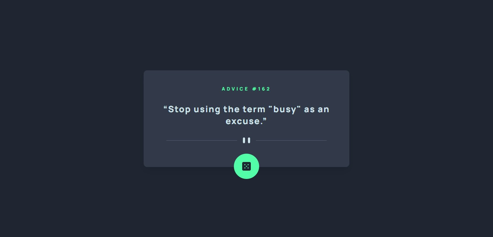
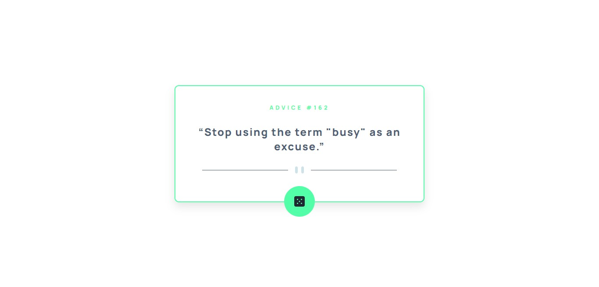

# Frontend Mentor - Advice generator app solution

This is a solution to the [Advice generator app challenge on Frontend Mentor](https://www.frontendmentor.io/challenges/advice-generator-app-QdUG-13db). Frontend Mentor challenges help you improve your coding skills by building realistic projects.

### The challenge

Users should be able to:

- Get a new advice by clicking the dice button, this advice must be different from the previous one.

### Screenshot




### Links

- Live Site URL: [AdviceGenerator](https://aleosw.github.io/AdviceGenerator/)

## My process

### Built with
- Semantic HTML5 markup
- CSS custom properties
- Flexbox
- Mobile-first workflow

### What I learned

Learn different ways to traverse an API.

```js
const getData = async () => {
  try {
        const API_URL = await fetch(apiUrl)
        const adviceData = await API_URL.json()
        console.log(adviceData)
    } catch (error) {
        console.log(error);
    }
}

fetch(apiUrl)
  .then(response => response.json())
    .then(data => {
      console.log(data)
    })

const getData = async () => {
    const API_URL = await fetch(apiUrl)
    return await API_URL.json()
}

```

## Author

- Frontend Mentor - [@AleoSw](https://www.frontendmentor.io/profile/@AleoSw)
